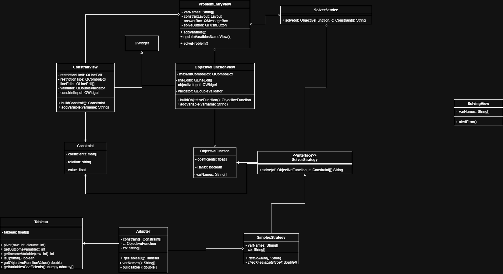

# Architecture ✍️

## Layers
- [Model](../model/): Fundamental classes nedded to understand and solve the lineal problems
- [Services](../services/): This classes use the model layer for solve the lineal problem
- [UI](../UI/): This layer propuse a visual interface for introduce the data and visualize the optimal solution
- [Test](../test/): it is used for make unit test and integrity test
- [Core](../core/): Contains the key algorithms to perform all the optimization process and its respective sensibility+s analysis.

## UML

This project follows the next UML diagramm class:

## Data flow and components
1. UI:Recive the input of the objective function and its respective constraints and the method selected for the process
2. Model: Build the contraints and objective function objects
3. Core: Select the respective model choosen by the user and solve the optimization problem
4. UI: Get the output of the solution and display it to the user.